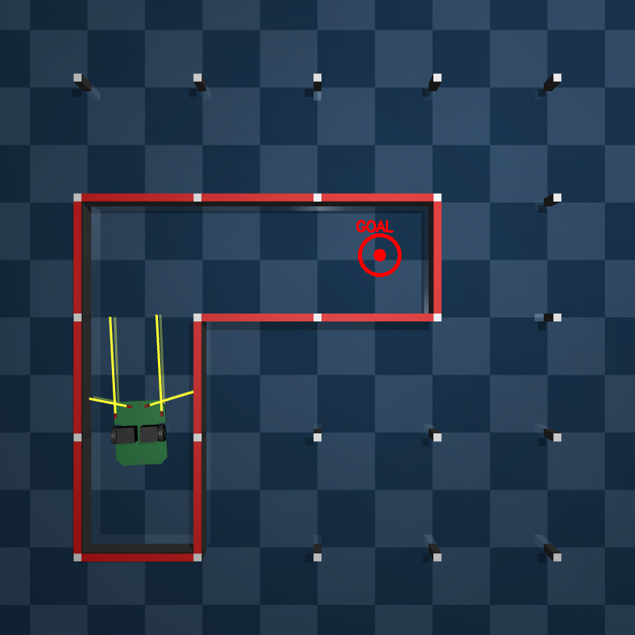
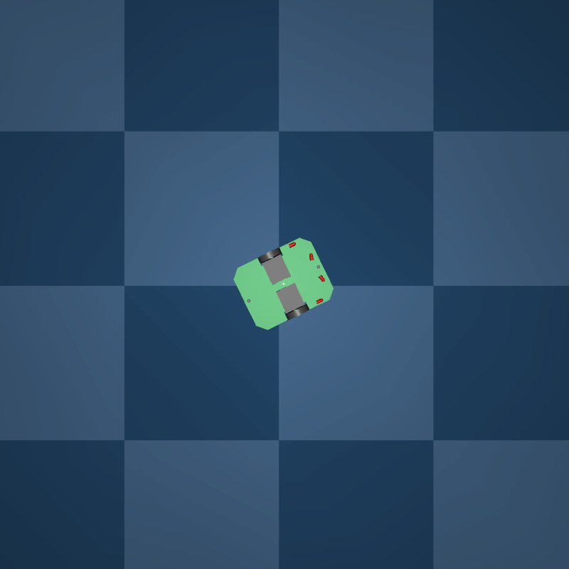
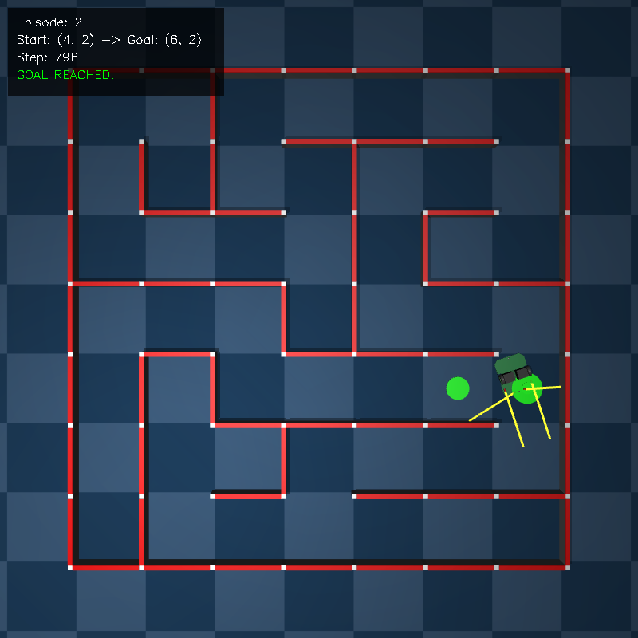
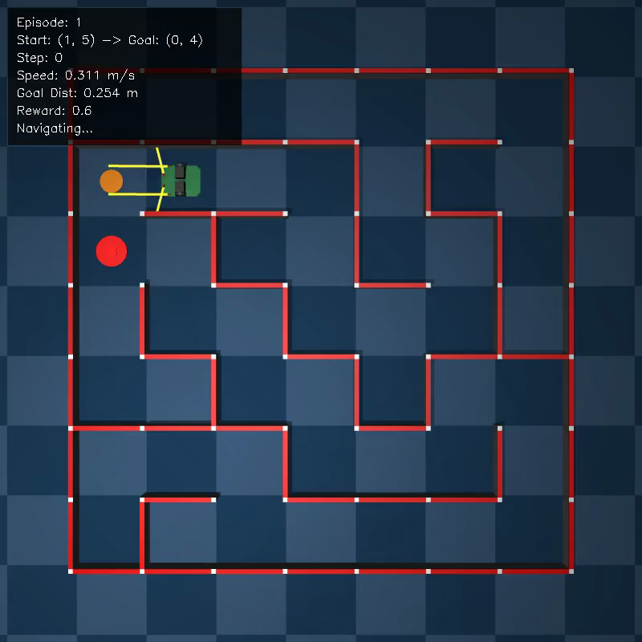

# Stable-Baselines3 + MuJoCo
# 強化学習入門

マイクロマウスプロジェクトで学ぶ実践的強化学習



---

## 目次

1. 強化学習とは
2. 環境構築
3. Gymnasium環境の基本
4. MuJoCo環境の作成
5. Stable-Baselines3で学習
6. 学習結果の評価と可視化
7. 本プロジェクトで実践
8. 報酬設計の実践例

---

<!-- _class: lead -->

# 1. 強化学習とは

---

## 直感的な理解：試行錯誤で学ぶ

強化学習（Reinforcement Learning）は、**試行錯誤を通じて学ぶ**機械学習の手法

### 例：自転車の乗り方を覚える

1. 最初はバランスを崩して転ぶ（失敗 → 悪い結果）
2. 少しずつコツをつかむ（成功 → 良い結果）
3. 何度も試すうちに、上手に乗れるようになる

**「やってみて、結果を見て、やり方を改善する」**

---

## 他の機械学習との違い

| 手法 | 学習方法 | 例 |
|------|---------|-----|
| **教師あり学習** | 正解データから学ぶ | 画像分類（猫/犬） |
| **教師なし学習** | データの構造を見つける | 顧客のグループ分け |
| **強化学習** | 試行錯誤で報酬を最大化 | ゲームAI、ロボット制御 |

---

## 強化学習が適しているケース

- ✅ 正解を定義しにくいが、良し悪しは判断できる
- ✅ 連続的な意思決定が必要
- ✅ シミュレーションで大量の試行が可能

### 本プロジェクトの例

マイクロマウスをゴールに導く「正解の動き」を人間が定義するのは困難
→ 「ゴールに近づいたら良い」「壁にぶつかったら悪い」という**報酬**で学習

---

## 基本用語①：エージェントと環境

### エージェント（Agent）
**学習する主体** = ゲームの「プレイヤー」
→ 本プロジェクト：マイクロマウスロボット

### 環境（Environment）
**エージェントが行動する世界** = ゲームの「世界」
→ 本プロジェクト：MuJoCoで再現した迷路

---

## 基本用語②：状態と行動

### 状態・観測（State / Observation）
**環境の現在の情報** = 「今どういう状況か」

- 距離センサの値（前方の壁までの距離）
- 現在の速度、目標速度

### 行動（Action）
**エージェントが選択する操作** = コントローラ入力

- 左モータの電圧（-3V 〜 +3V）
- 右モータの電圧（-3V 〜 +3V）

---

## 基本用語③：報酬

### 報酬（Reward）
**行動の良し悪しを示す数値**

| 状況 | 報酬 |
|------|------|
| 目標速度に近い | +1.0 |
| 目標速度から外れる | 0.0 や負の値 |
| 壁にぶつかる | -10 |
| ゴールに到達 | +1000 |

エージェントは**報酬を最大化**するように学習する

---

## 報酬設計のポイント

### ❌ 悪い例
「ゴール到達時のみ +1」
→ ゴールに辿り着くまで何も学習できない（スパースすぎる）

### ✅ 良い例
「ゴールに近づくほど報酬が増える」
→ 少しずつ改善する方向がわかる

**報酬設計は強化学習で最も重要な要素**

---

## 基本用語④：ポリシーとエピソード

### ポリシー（Policy）
**状態から行動への対応規則** = ルールブック

```
ポリシー π: 状態 s → 行動 a

例：前方に壁が近い → 減速する
```

### エピソード（Episode）
**開始から終了までの一連の流れ** = 1プレイ

- 開始：スタート位置に配置
- 終了：ゴール到達、衝突、時間切れ

---

## 強化学習のループ

```
① 観測 → ② 行動選択 → ③ 行動実行 → ④ 結果観測 → ⑤ 学習
    ↑                                                    │
    └────────────────────────────────────────────────────┘
```

1. エージェントが環境の状態を**観測**
2. ポリシーに従って**行動を決定**
3. 環境に行動を**適用**
4. 新しい状態と**報酬を受け取る**
5. 報酬をもとにポリシーを**改善**

---

## 具体例：学習の流れ

**ステップ1:**
- 観測: 前方の壁まで0.1m、目標速度0.5m/s
- 行動: 加速（左右モータ2.0V）
- 結果: 速度0.45m/sに上昇 → **報酬 +0.9** ✓

**ステップ2:**
- 観測: 前方の壁まで0.05m（近い！）
- 行動: そのまま加速
- 結果: 壁に衝突！ → **報酬 -10** ✗

**学習:** 「壁が近いときに加速するのは良くない」

---

## 価値関数と割引率

### 長期的な報酬を考える

チェスの例：
- 今すぐ駒を取る（+1）→ 次ターンでクイーンを取られる（-9）= **損**
- 守る（0）→ 数手後にチェックメイト（+100）= **得**

### 割引率 γ（ガンマ）

```
γ = 0.99 の場合:
  1ステップ後の報酬 × 0.99
  2ステップ後の報酬 × 0.99²
  ...
```

γ が 1 に近い → 長期的な報酬を重視

---

<!-- _class: lead -->

# 2. 環境構築

---

## 必要なパッケージ

```bash
# 仮想環境の作成（推奨）
python -m venv .venv
source .venv/bin/activate

# 必須パッケージ
pip install mujoco           # 物理エンジン
pip install gymnasium        # 環境インターフェース
pip install stable-baselines3 # 強化学習アルゴリズム

# 可視化用
pip install matplotlib opencv-python imageio
```

---

## インストール確認

```python
import mujoco
import gymnasium as gym
import stable_baselines3 as sb3

print(f"MuJoCo: {mujoco.__version__}")
print(f"Gymnasium: {gym.__version__}")
print(f"Stable-Baselines3: {sb3.__version__}")
```

---

<!-- _class: lead -->

# 3. Gymnasium環境の基本

---

## Gymnasium とは

強化学習環境の**標準インターフェース**を提供するライブラリ
（旧 OpenAI Gym）

### 環境クラスの必須メソッド

| メソッド | 役割 |
|---------|------|
| `__init__()` | 初期化、空間定義 |
| `reset()` | 環境をリセット |
| `step(action)` | 1ステップ実行 |
| `render()` | 描画 |
| `close()` | リソース解放 |

---

## 空間の定義

```python
from gymnasium import spaces
import numpy as np

# 離散空間（選択肢から1つ選ぶ）
discrete = spaces.Discrete(4)  # 0, 1, 2, 3

# 連続空間（範囲内の実数値）
box = spaces.Box(
    low=-1.0,
    high=1.0,
    shape=(2,),  # 2次元
    dtype=np.float32
)
```

本プロジェクト：モータ電圧は**連続空間**

---

## 環境クラスのテンプレート

```python
class MyEnv(gym.Env):
    def __init__(self, render_mode=None):
        # 行動空間：2次元連続値 [-1, 1]
        self.action_space = spaces.Box(
            low=-1.0, high=1.0, shape=(2,), dtype=np.float32
        )
        # 観測空間：4次元連続値
        self.observation_space = spaces.Box(
            low=-np.inf, high=np.inf, shape=(4,), dtype=np.float32
        )
```

---

## reset() と step()

```python
def reset(self, seed=None, options=None):
    """環境を初期状態にリセット"""
    observation = ...  # 初期観測
    info = {}
    return observation, info

def step(self, action):
    """1ステップ実行"""
    observation = ...  # 新しい観測
    reward = ...       # 報酬
    terminated = ...   # 終了フラグ（ゴール等）
    truncated = ...    # 打ち切りフラグ（時間切れ等）
    info = {}
    return observation, reward, terminated, truncated, info
```

---

<!-- _class: lead -->

# 4. MuJoCo環境の作成

---

## MuJoCo とは

**Multi-Joint dynamics with Contact**
高速で正確な物理シミュレーションエンジン

### 基本概念

| 概念 | 説明 |
|------|------|
| **モデル（MjModel）** | シミュレーション世界の定義（XML） |
| **データ（MjData）** | 現在の状態 |
| **制御（ctrl）** | アクチュエータへの入力 |
| **センサ（sensordata）** | センサ出力値 |

---

## XMLモデルファイルの例

```xml
<mujoco model="simple_robot">
  <worldbody>
    <geom type="plane" size="1 1 0.1"/>  <!-- 地面 -->

    <body name="robot" pos="0 0 0.1">
      <joint type="free"/>
      <geom type="box" size="0.1 0.05 0.02"/>

      <!-- 車輪 -->
      <body name="left_wheel" pos="-0.05 0.06 0">
        <joint name="left_motor" type="hinge" axis="0 1 0"/>
        <geom type="cylinder" size="0.02 0.01"/>
      </body>
    </body>
  </worldbody>
</mujoco>
```

---

## MuJoCo環境の実装

```python
import mujoco

class MuJoCoEnv(gym.Env):
    def __init__(self, xml_file="model.xml"):
        # モデル読み込み
        self.model = mujoco.MjModel.from_xml_path(xml_file)
        self.data = mujoco.MjData(self.model)

    def step(self, action):
        # 制御入力を設定
        self.data.ctrl[:] = action * 3.0  # スケーリング

        # シミュレーション実行
        for _ in range(5):
            mujoco.mj_step(self.model, self.data)
```

---

<!-- _class: lead -->

# 5. Stable-Baselines3で学習

---

## Stable-Baselines3 とは

PyTorchベースの高品質な強化学習アルゴリズム実装

### 対応アルゴリズム

| アルゴリズム | 行動空間 | 特徴 |
|-------------|---------|------|
| **PPO** | 連続/離散 | 安定性が高く汎用的 ★推奨 |
| **SAC** | 連続 | サンプル効率が高い |
| **TD3** | 連続 | 高性能だがチューニング必要 |
| **A2C** | 連続/離散 | シンプルで高速 |
| **DQN** | 離散のみ | 離散行動の定番 |

---

## PPO（Proximal Policy Optimization）

**最も広く使われているアルゴリズム**

### 特徴
- ポリシー勾配法の一種
- クリッピングで安定した学習
- Actor-Critic構造

### メリット
- ハイパーパラメータに対してロバスト
- デフォルト値でも動くことが多い
- 連続・離散どちらにも対応

---

## SAC（Soft Actor-Critic）

**サンプル効率が高いオフポリシー手法**

### 特徴
- 最大エントロピー強化学習
- 経験再生バッファを使用
- 探索と活用のバランスを自動調整

### 使いどころ
- 経験収集コストが高い場合（実機ロボットなど）
- 連続行動空間のみ

---

## アルゴリズム選択ガイド

```
タスクの行動空間は？
├── 離散（上下左右など）
│   └── DQN
│
└── 連続（モータ電圧など）
    ├── 初心者 or 安定性重視 → PPO ★
    ├── サンプル効率重視 → SAC
    └── 最高性能追求 → TD3
```

**本プロジェクト：PPOを採用**
→ シミュレーションで大量の経験を集められるため

---

## 基本的な学習コード

```python
from stable_baselines3 import PPO
from stable_baselines3.common.callbacks import CheckpointCallback

# 環境作成
env = MyEnv(render_mode=None)

# モデル作成
model = PPO("MlpPolicy", env, verbose=1)

# 学習
model.learn(total_timesteps=1_000_000)

# 保存
model.save("models/my_model")
```

---

## PPOのハイパーパラメータ

```python
model = PPO(
    "MlpPolicy",
    env,
    learning_rate=3e-4,    # 学習率
    n_steps=2048,          # 更新前に収集するステップ数
    batch_size=64,         # ミニバッチサイズ
    n_epochs=10,           # エポック数
    gamma=0.99,            # 割引率
    clip_range=0.2,        # PPOクリップ範囲
    verbose=1
)
```

---

<!-- _class: lead -->

# 6. 学習結果の評価と可視化

---

## 学習済みモデルでテスト

```python
from stable_baselines3 import PPO

# モデル読み込み
model = PPO.load("models/my_model")

# テスト環境（レンダリングあり）
env = MyEnv(render_mode="human")

obs, _ = env.reset()
for _ in range(1000):
    action, _ = model.predict(obs, deterministic=True)
    obs, reward, terminated, truncated, info = env.step(action)

    if terminated or truncated:
        obs, _ = env.reset()
```

---

## 動画の保存

```python
import imageio

env = MyEnv(render_mode="rgb_array")
model = PPO.load("models/my_model")

frames = []
obs, _ = env.reset()

for _ in range(500):
    action, _ = model.predict(obs, deterministic=True)
    obs, reward, terminated, truncated, _ = env.step(action)
    frames.append(env.render())
    if terminated or truncated:
        break

imageio.mimsave("evaluation.mp4", frames, fps=30)
```

---

<!-- _class: lead -->

# 7. 本プロジェクトで実践

---

## プロジェクト構造

```
micromouse_rl/
├── phase1_open/     # 低レベル速度制御
├── phase2_slalom/   # スラローム走行
├── phase3_maze/     # 迷路ナビゲーション
├── common/          # 共通ユーティリティ
├── models/          # 訓練済みモデル
└── assets/          # MuJoCo XMLファイル
```

---

## 階層型RL構造

```
Phase 3 Policy（高レベル）
    ↓ 目標速度（線速度、角速度）
Phase 1 Controller（低レベル）
    ↓ モータ電圧
MuJoCo Physics Engine
```

- **Phase 1:** モータ制御を学習
- **Phase 3:** Phase 1を使って迷路ナビゲーション

---

## Phase 1: 速度制御デモ



**タスク:** 目標速度を正確に追従

- 入力: センサ値、現在速度、目標速度
- 出力: 左右モータ電圧
- 報酬: 速度追従誤差の最小化

📹 [デモ動画](images/phase1_demo.mp4)

---

## Phase 2: スラローム走行デモ


**タスク:** L字カーブをスムーズに走行

- Phase 1を低レベル制御として使用
- 高レベルポリシーが目標速度を決定
- 階層型RLの実証

📹 [デモ動画](images/phase2_demo.mp4)

---

## Phase 3: 迷路ナビゲーションデモ



**タスク:** ランダム生成迷路でゴールに到達

- 7×7のランダム迷路で汎化
- 中間目標を設定して段階的に誘導
- 壁との距離、進行方向も報酬に反映

📹 [デモ動画](images/phase3_demo.mp4)

---

## Phase 4: 高速走行学習デモ



**タスク:** 最速でゴールに到達

- Phase 3をベースに速度最大化を目標
- センサパターンから最適速度を学習
- 直進では加速、ターン前では減速

📹 [デモ動画](images/phase4_demo.mp4)

---

## 実行コマンド

```bash
# Phase 1: 低レベル制御の訓練
python phase1_open/train.py

# Phase 3: 迷路ナビゲーションの訓練
python phase3_maze/train.py

# Phase 4: 高速走行の訓練
python phase4_speed/train.py

# 評価
python phase4_speed/evaluate.py
```

---

<!-- _class: lead -->

# 8. 報酬設計の実践例

---

## 報酬設計の重要性

**報酬関数は強化学習の成否を決める最重要要素**

### よくある失敗パターン

| パターン | 問題 | 結果 |
|---------|------|------|
| スパースすぎる | ゴール到達のみ報酬 | 学習が進まない |
| 矛盾した報酬 | 速度報酬と安全報酬の競合 | 不安定な挙動 |
| 報酬ハッキング | 意図しない抜け道 | 望まない行動を学習 |

---

## Phase 1: 速度追従の報酬設計

**目標:** 指定された目標速度を正確に追従する

```python
# 報酬関数
r_velocity = -|v_actual - v_target|    # 速度誤差ペナルティ
r_angular = -|ω_actual - ω_target|     # 角速度誤差ペナルティ
r_smooth = -|Δv| - |Δω|                # 急な変化を抑制

reward = r_velocity + r_angular + r_smooth
```

### 設計理由

- **負の報酬（ペナルティ）方式**: 誤差を0に近づける学習が容易
- **スムーズネス報酬**: ガクガクした動きを防止

---

## Phase 2: スラローム走行の報酬設計

**目標:** L字カーブをスムーズに通過する

```python
r_progress = 20.0 * Δdist_to_goal  # ゴール接近報酬
r_time = -0.01                      # 時間ペナルティ
r_collision = -50.0                 # 衝突ペナルティ
r_goal = 200.0                      # ゴール到達報酬

reward = r_progress + r_time + r_collision + r_goal
```

### 設計理由

- **進行報酬**: 常に前進を促す（スパース報酬の回避）
- **時間ペナルティ**: 効率的なルート選択を促進

---

## Phase 3: 迷路ナビゲーションの報酬設計

**目標:** ランダム迷路でゴールに到達する

```python
r_goal = 400.0                     # ゴール到達
r_intermediate = 100.0             # 中間目標到達
r_progress = 25.0 * Δdist          # ゴール接近
r_speed = 0.2 * v                  # 速度報酬
r_time = -0.03                     # 時間ペナルティ
r_collision = -100.0               # 衝突ペナルティ

reward = r_goal + r_intermediate + r_progress + ...
```

### 設計理由

- **中間目標報酬**: 2セル先のゴールへ段階的に誘導
- **低い速度報酬**: 安全性を優先

---

## Phase 4: 高速走行の報酬設計

**目標:** 安全かつ**最速**でゴールに到達する

```python
r_goal = 500.0                     # ゴール到達（増額）
r_speed = 3.0 * v                  # 速度報酬（大幅強化）
r_time = -0.5                      # 時間ペナルティ（強化）
r_angular = -0.1 * |ω|             # 蛇行抑制
r_straight = 0.3                   # 直進ボーナス
r_smoothness = -0.3 * |Δv| - 0.3 * |Δω|

reward = r_goal + r_speed + r_time + r_angular + ...
```

---

## Phase 3 → Phase 4: 報酬変更の比較

| 要素 | Phase 3 | Phase 4 | 変更理由 |
|------|---------|---------|---------|
| **速度報酬** | 0.2×v | **3.0×v** | 高速走行の強力な誘因 |
| **時間ペナルティ** | -0.03 | **-0.5** | 早期到達への強い圧力 |
| **進行報酬** | 25×Δd | 削除 | 速度報酬に統合 |
| **角速度ペナルティ** | なし | **-0.1×\|ω\|** | 蛇行抑制 |
| **直進ボーナス** | なし | **+0.3** | 直線での加速促進 |

---

## 報酬調整の試行錯誤（Phase 4）

### 実際の調整過程

| バージョン | 成功率 | 平均速度 | 問題点 |
|-----------|--------|----------|--------|
| **v1** | 60% | 0.96 m/s | 蛇行が多い |
| **v2** | 10% | 0.99 m/s | 角速度ペナルティが強すぎて旋回不能 |
| **v3** | 73% | 0.93 m/s | バランス良好 ✓ |

### 学んだこと

- **報酬は慎重に調整**: 小さな変更でも大きな影響
- **複数の指標を監視**: 成功率だけでなく速度も確認
- **失敗から学ぶ**: v2の失敗がv3の成功につながった

---

## 報酬設計のベストプラクティス

### 1. シェーピング報酬を活用
ゴールだけでなく、途中の良い行動にも報酬を与える

### 2. 報酬のスケールを意識
各報酬項目のバランスが重要（大きすぎると他を無視）

### 3. 段階的に複雑化
Phase 1 → 2 → 3 → 4 と段階的に難易度を上げる

### 4. 観察と修正
学習結果を観察し、問題があれば報酬を修正

---

## 報酬設計の課題と今後

### 現状の課題

本プロジェクトの報酬設計は、**アドホックな試行錯誤**の繰り返しに陥っている感が否めない

- 「うまくいかない → パラメータを変える → また試す」の泥沼
- 体系的なアプローチが欠如
- 最適な報酬構造に到達する保証がない

### 今後の展望

上位の研究者が用いるテクニックを調査・導入したい：

- **Reward Shaping の理論的基盤**（ポテンシャルベース等）
- **Inverse Reinforcement Learning**（エキスパートから報酬を学習）
- **Curriculum Learning** の体系的な設計
- **自動報酬探索**（AutoRL、進化的手法）

→ 現状できていないことが**今後の重要な課題**

---

## まとめ

1. **Gymnasium** で環境インターフェースを実装
2. **MuJoCo** で物理シミュレーションを構築
3. **Stable-Baselines3** のPPOで学習
4. **報酬関数** の設計がタスク成功の鍵

### 次のステップ
- Phase 1から始めて段階的に挑戦
- 報酬関数を変えて実験
- ハイパーパラメータをチューニング

---

<!-- _class: lead -->

# ありがとうございました

### 参考リンク
- [Stable-Baselines3 ドキュメント](https://stable-baselines3.readthedocs.io/)
- [MuJoCo ドキュメント](https://mujoco.readthedocs.io/)
- [Gymnasium ドキュメント](https://gymnasium.farama.org/)
